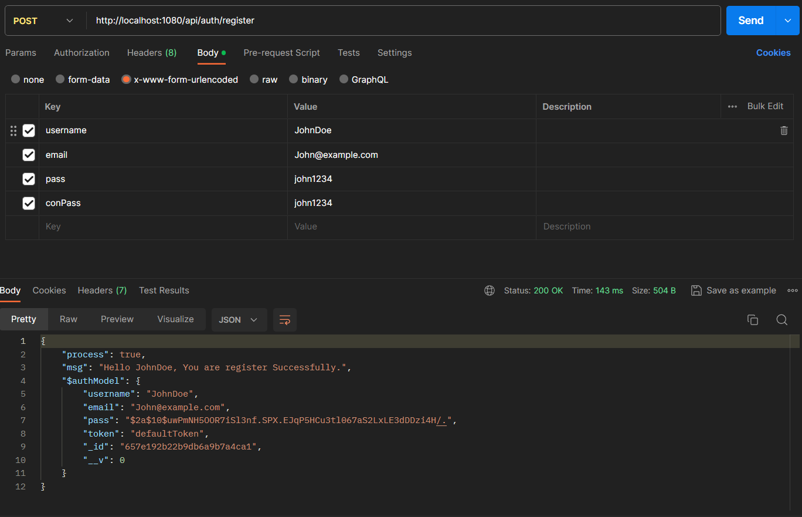

# 🎓 Authentication

## ⚙️ Installation Dependency

#### 🔺 Frontend
- npm create vite
- npm install

#### 🔺 backend
- npm init
- npm install express
- npm install dotenv
- npm install mongoose
- npm install bcryptjs

****
****
****

## 📌 Backend

### 🔺 Server listening and database connection

#### Create `.env` file

```js
PORT = 1080
DATABASE = "mongodb://127.0.0.1:27017/authdoc"
```

#### Database Connection

`/configs/databaseConnection.js`

```js
module.exports = async URL => await require("mongoose")
    .connect(URL)
    .then(console.log("Connected Database..."));
```

#### server listening and database connection in `index.js`

`index.js`

```js
const express = require("express")
const $server = express()
$server.use(express.json())
$server.use(express.urlencoded({ extended: true }))

// require dotenv
require("dotenv").config()
// require databaseConnection 
require("./configs/databaseConnection")(process.env.DATABASE)

const PORT = process.env.PORT
$server.listen(PORT, () => console.log(`Server Started: http://localhost:${PORT}`))
```

****
****

## 🔺 Create Schema and module

`/modules/authModel.js`

```js
const mongoose = require("mongoose")

const authSchema = mongoose.Schema({
    username: { type: String },
    email: { type: String },
    pass: { type: String },
    conPass: { type: String },
    token: { type: String, default: "defaultToken" }
})

const authModule = mongoose.model("authData", authSchema)

module.exports = authModule
```

****
****

## 🔺 post user data in database using `post` method

`/controllers/registerUser.js`

```js
const $authModel = require("../models/authModel")
const $bcrypt = require("bcryptjs")

const registerUser = async (req, res) => {
    const { username, email, pass, conPass } = req.body
    const existingEmail = await $authModel.findOne({ email })
    const existingUsername = await $authModel.findOne({ username })

    try {
        if (existingEmail) throw "This email is already exist"
        if (existingUsername) throw "This username is already exist"
        if (!pass) throw "Password is required"
        if (!conPass) throw "Also require confirm password"
        if (pass !== conPass) throw "Does not match password and confirm password"

        if (username, email, pass) {
            const userSuccessMsg = `Hello ${username}, You are register Successfully.`
            res.send({
                process: true, msg: userSuccessMsg, $authModel: await $authModel({
                    username, email, pass: await $bcrypt.hash(pass, 10)
                }).save()
            })
        }
    } catch (err) {
        res.send({ process: false, msg: err })
    }
}

module.exports = registerUser
```

****
****

## 🔺 Setup router

`/router/authRouter.js`

```js
const express = require("express")
const registerUser = require("../controllers/registerUser")

const authRouter = express.Router()

// require registerUser.js
authRouter.route("/register").post(registerUser)

module.exports = authRouter

```

#### Use router in `index.js`

`index.js`

```js
const authRouter = require("./routers/authRouter")

// authentication router
$server.use("/api/auth", authRouter)
```

****
- Now ready to user register post data from :-
  
  `http://localhost:1080/api/auth/register`

## 🔺 Using postman with post register data

- urlencoded method



- This also use method :- json row data parse

```json
{
    "username": "JohnDoe",
    "email": "John@example.com",
    "pass": "john123",
    "conPass": "john123"
}
```

****